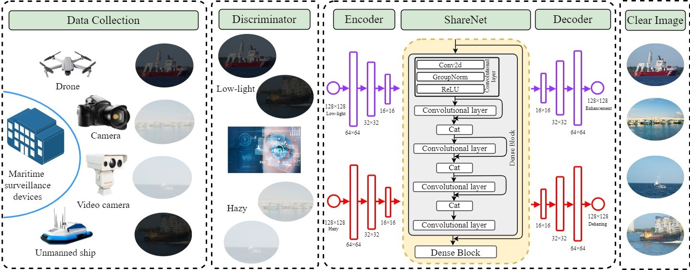

# <p align=center> [OCMA] Deep learning-driven surveillance quality enhancement for maritime management promotion under low-visibility weathers</p>

<div align="center">

[](https://www.sciencedirect.com/science/article/pii/S0964569123000030)
  


</div>

---
>**Deep learning-driven surveillance quality enhancement for maritime management promotion under low-visibility weathers**<br>  Jingxiang Qu, Yuan Gao, Yuxu Lu, Wenyu Xu, and Wen Liu * (* indicates corresponding author) <br> 
>Ocean & Coastal Management

> **Abstract:** *Visual sensors are widely employed for real-time maritime surveillance. But they always suffer from some low-visibility problems, typically low light and haze, which greatly reduce the effectiveness of maritime management. In practical applications, the most common strategy is using separate networks to overcome different low visibility problems. It needs large space for parameter storage. Besides, when the weather changes, the enhancement methods need to be toggled artificially, and the enhancement effect is unsatisfactory due to the lack of maritime dataset. To tackle these problems, we designed a learned parameter sharing (LPS)-based versatile visibility enhancement network (LPSNet) and trained it on the synthetic maritime dataset. It enhances the quality of captured surveillance data under both low-light and hazy environments via a versatile model. Due to the LPS between different low-visibility enhancement tasks, the proposed network performs better on the mutual problems, like noise suppression and detail preservation. Therefore, our LPSNet achieves superior enhancement effect on both low-light enhancement and dehazing. Besides, the running time is shorter than most of the previous methods, which can enhance 800 × 600 images over 18 FPS. Moreover, the comparison experiment on vessel detection task indicates the benefits of the proposed method on maritime management promotion under low-visibility weathers. The source code is available at
https://github.com/YuanGao-YG/LPSNet.*
<hr />

## Requirement

- Python 3.7
- Pytorch 1.12.0

## Network Architecture


## Test
* Place the pre-training weight in the `./checkpoint` folder.
* Place test low-visibility images in the `./dataset/Test` folder.
* Run `demo.py`
* The results is saved in `./result` folder.

## Citation

```
@article{qu2023deep,
  title={Deep learning-driven surveillance quality enhancement for maritime management promotion under low-visibility weathers},
  author={Qu, Jingxiang and Gao, Yuan and Lu, Yuxu and Xu, Wenyu and Liu, Ryan Wen},
  journal={Ocean \& Coastal Management},
  volume={235},
  pages={106478},
  year={2023},
  publisher={Elsevier}
}
